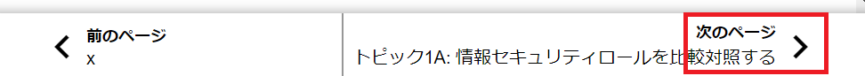
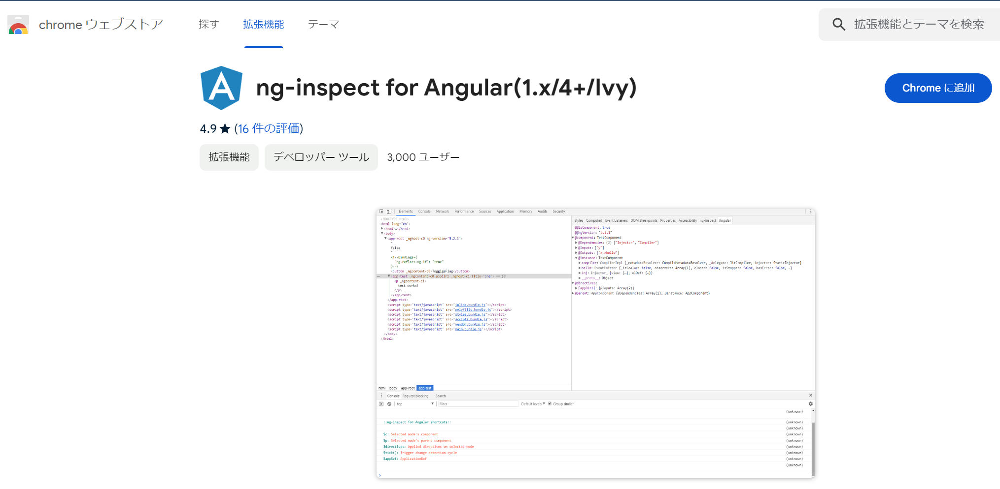
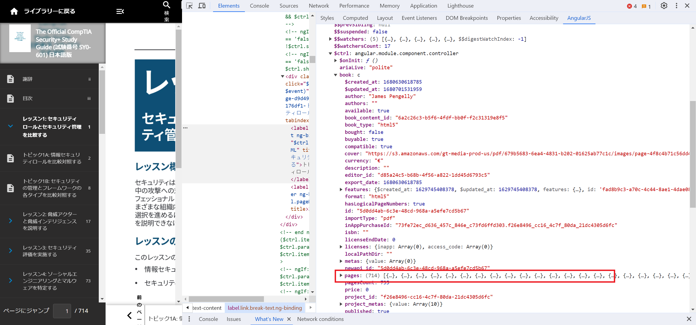

# AutoRead

puppeteerによりchromeを操作し, Comptiaのテキストをダウンロードする。

## 事前準備

### パッケージインストール

```bash
npm install
```

### comptiaへのログイン情報を環境変数に保存

.env

```
EMAIL=***
PASSWORD=***
```

## ページURL一覧の準備

### pupeteerだけではページ遷移ができない

pupeteerでComptiaのテキストにアクセスできても、「次のページ」ボタンはpupeteerで押せなくなっている（おそらくスクレイピング対策）。そのためpupeteerでテキストのあるページにアクセスしても、そこから他のページに遷移できなかった。



また、各ページのurlは以下のようにページ番号がランダムなidになっているため簡単には予測できない仕組みになっている。

`https://officialcomptiastudyguides.webreader.io/#!/reader/6a2c26c3-b5f6-4fdf-bb0f-f2c31319e8f5/page/page-8c4310d62412dce9a34035480a697194`


さらに、「次のページ」ボタンはリンクになっているわけではなく、クリックされるとJavaScriptのリスナーイベントが次のページのurlを生成し、ページ遷移させているため、「次のページ」ボタンにはurl情報は一切含まれていない。

### 回避策

JavaScriptが各ページのurlを生成している以上、JavaScriptの変数には各ページのid情報が含まれている。なのでその変数情報を直接取得する。

ComptiaのサイトはフロントエンドフレームワークにAngularを使用している。

以下のAngularデバッグ用の拡張機能をインストールすればAngularが保持している変数を見ることができる。



[https://chromewebstore.google.com/detail/ng-inspect-for-angular1x4/onfmmmemcmipkohkkgofiojpiahbpogh](https://chromewebstore.google.com/detail/ng-inspect-for-angular1x4/onfmmmemcmipkohkkgofiojpiahbpogh)





し、chromeの開発者ツールのAngularJSタブで各オブジェクトを閲覧する。`$ctrl`オブジェクトのなかに`book`, `pages`情報が含まれている。`pages`オブジェクトに全ページのidが保持されている。

この際、マウスカーソルをサイドバーの目次のあたりに合わせると`$ctrl`
オブジェクトが見つかりやすい。（page情報関連の操作を行うコンポーネントだから?）

## スクリプトの実行

```bash
node index.js
```